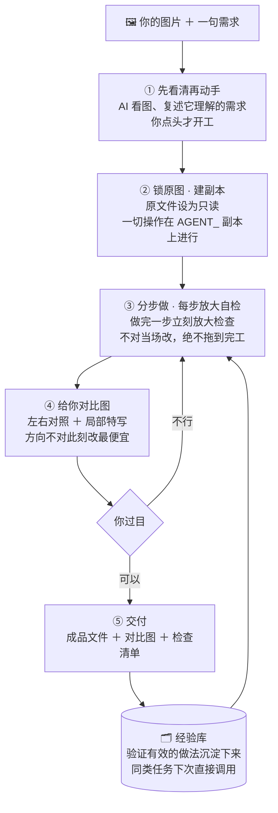

# ps-mcp

**让你的 AI 助手真正会"干净地"用 Photoshop——修图、切图、批量处理，每一步都放大给你看，绝不碰你的原图。**



## 它是什么

想让 AI 帮你修图，会撞上三个死结：

1. **它手一滑，你的原图就没了**——AI 直接在你的文件上操作，一次保存，几年的底片素材就回不去了；
2. **它说"修好了"，可它到底仔细看了吗**——很多 AI 修图不是不会，是没细看：糊了一块、留了道痕，它自己都不知道，你更看不出来；
3. **Photoshop 的弹窗会把它卡死**——启动时随便弹个"暂存盘空间不足"的警告，自动化就连不上，报一个没人看得懂的错（`0x80080005`），网上教你改注册表的教程基本都是错方向。

这个工具就是为这三件事造的。整个思路一句话：

> **不让 AI 直接动你的文件——让它在一份"工作副本"上干活，每做一步都放大看一遍。**

具体做法：

- 你的**原文件全程只读**；所有修改发生在带 `AGENT_` 前缀的副本上（文件名一眼可辨，哪个是原件、哪个是 AI 的工作文件）；
- 每次做**不可逆的操作**（合并图层、删除、大改）之前，先自动存一个中间版本——随时能退回去；
- 每做完一步，AI 必须**放大检查结果、和做之前对比**，发现不对当场修正，绝不"修完才发现全错了"；
- 完工交付**成品文件 ＋ 左右对比图 ＋ 局部特写**，外加一张"我检查过哪些画面"的清单——不用你信任它，用眼睛验。

## 特点（为什么值得用）

- **你的原图是只读的**——AI 再手滑也伤不到原件：改动全在带 `AGENT_` 前缀的副本上，导出成新文件。
- **改坏了能退回去**——每次不可逆操作前自动存档一个中间版本，随时回退，不用重做。
- **每一步都放大检查**——不是修完才看：每做完一步就放大自检、不对当场改。这正是它和"一把梭"的根本区别。
- **完工给你对比图**——左右对照 ＋ 出问题地方的局部放大，你自己验，不用听它口头保证。
- **开工先复述需求**——先看清你的图、把"我以为你要什么"说一遍，你点头才动手；这时候纠正方向最便宜。
- **自动处理 Photoshop 的烦人弹窗**——"暂存盘空间不足"之类的启动警告会让自动化整个卡死（报 `0x80080005`），它会自动发现并妥善处理，然后正常连接。这是反复实测确认的原因，不是猜测。
- **知道什么该用 PS、什么不该**——自动区分八类需求：照片修图 / 创意合成 / 平面设计 / 切图导资产 / 批量处理 / 绘画辅助 / AI 生成 / 以及"这事不该用 Photoshop 做"——最后这类它会直接告诉你该用什么工具，不硬做。
- **经验会累积**——每完成一个真实任务，把被验证有效的做法沉淀进"经验库"，同类任务下次直接调用（经验库刚起步，随着你的任务长大）。
- **可选接你自己电脑上的 AI 模型**——接入本地 LM Studio 后，用它来内部挑选经验条目，数据不出本机；不接也完全能跑。
- **一条命令自检环境**——装好先体检：连接、版本、核心工具，绿灯了再开工。
- **每个结论都标可信度**——手册里每条经验都标了「实测过 / 查资料 / 待验证」；换 Photoshop 版本时，哪些结论要重新确认，一目了然。

## 它怎么工作（对照上面那张图）

1. **先看清再动手**——AI 打开你的图，说清楚"我看到的 + 我理解你要什么"，你确认后才开工。
2. **锁原图 · 建副本**——原文件只读；建立 `AGENT_` 工作副本；不可逆操作前自动存档。
3. **分步做 · 每步放大自检**——一步一检查：放大看结果，和做之前对比，不对当场改；同一个问题改两次还不行，就停下来拿着对比图找你定夺。
4. **给你对比图**——关键节点（一般是最容易跑偏的时刻）先给你看，方向确认了继续，不对就回炉。
5. **交付**——成品文件＋对比图＋局部特写＋检查清单；文件只写到你说过的地方，绝不覆盖已有文件。
6. **经验回填**——把这次验证有效的做法记进经验库，下次同类任务直接用。

## 你要做的（三步）

```bash
# 1. 把这个文件夹放好，对 AI 助手说：
#    "读 SKILL.md，按它操作。"

# 2. 环境体检（会自动帮你启动 Photoshop，并处理启动弹窗）
powershell -NoProfile -ExecutionPolicy Bypass -File scripts/ps_connect.ps1
#    看到 OK-CONNECT 和版本号（如 v=27.10）就是通了

# 3. 给助手：文件路径 + 想要的效果
#    例："把这张图的白色网格去掉"
#    例："这批 200 张图统一调色，导出成同名副本"
```

## 修完长什么样

| 你会拿到 | 说明 |
|---|---|
| 你的原文件 | **原样未动**（连修改时间都没变） |
| 工作副本 | 带 `AGENT_` 前缀的中间文件，留在工作目录里，可删可留作对照 |
| 成品文件 | 新文件，不覆盖任何已有文件；编号递增，随时能找到历史版本 |
| 对比图 | 处理前后左右对照；关键部位还有局部放大特写 |
| 检查清单 | AI 声明"我检查过哪些画面"的清单——每一条都能在磁盘上找到对应图片 |

## 靠谱吗

- **实测环境**：Adobe Photoshop 2026（27.10）＋ Windows，全流程实测——连接、建档、编辑、导出、回读核对，全部走通并留档。
- **首个真实任务就是一次完整的"打回重做"记录**：去白色网格。第一版交付被用户打回（有残痕），第二版换数学方法还原通过；随后还做了**独立复核**（机器逐线扫描 ＋ 放大复查），又发现两处极淡的痕迹，第三版精修交付。**全过程（包括失败的那一版）都写进了仓库里的案例复盘**——我们说好不算好，留痕可查。
- **不是"AI 说好就好"**：交付要过机器检查（尺寸、格式、逐线扫描）＋ 放大目检，两关都过才算完。
- **不要求你信任工具**：每一条结论都能自己翻回原文/原图核实——手册和案例里写明了每一个判断是怎么得出来的。

## 环境要求

- Windows
- Adobe Photoshop（在 **2026 版 27.10** 上完整实测；其他版本可用，手册里每条结论都标了可信度，换版本时你会知道哪些要重新确认）
- **不需要**：插件、UXP 开发者工具、任何第三方软件（脚本只用系统自带能力）

## 隐私

- 全程本机运行，不收集、不上传任何数据
- 仓库内容不含任何个人信息；示例中的个人路径均已脱敏
- 可选功能（本地 AI 模型）只连接你自己电脑上的本地服务

## 给想改它的人

| 目录 | 是什么 |
|---|---|
| `SKILL.md` | 操作手册主入口（怎么连、怎么保安全、什么任务走什么流程） |
| `references/` | 分册：任务问询、连接与故障处理、图层与色彩机制、导出交付、经验库 |
| `scripts/` | 工具脚本：环境体检、文档盘点、任务模板、本地模型调用 |
| `docs/` | 实测记录、决策记录、案例复盘（含上面那个"打回重做"的完整过程） |
| `evals/` | 发版前自检脚本：`py evals/run-regression-checks.py` 一条命令自检 |

## 许可

MIT
